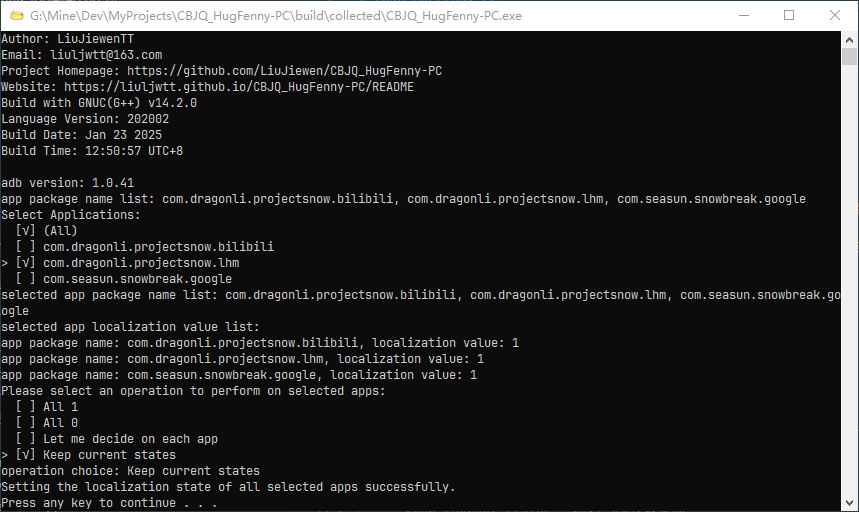

# CBJQ_HugFenny-PC

    

   
   
   
   

众所周知，只有本地人能抱走芬妮！

这个程序将帮助你抱走芬妮！[舞狮.jpg]

## 简介

这是一个PC端程序，你需要把你的安卓机连接到电脑，开启手机/平板的开发者选项和调试选项，同时在电脑上准备好adb程序（你下载的发行包内可能会附带），这样才能帮你在手机上抱走芬妮（开启本地化配置）。

项目地址：[https://github.com/LiuJiewenTT/CBJQ_HugFenny-PC](https://github.com/LiuJiewenTT/CBJQ_HugFenny-PC) 
项目主页：[https://LiuJiewenTT.github.io/CBJQ_HugFenny-PC](https://LiuJiewenTT.github.io/CBJQ_HugFenny-PC) 
下载页：[https://github.com/LiuJiewenTT/CBJQ_HugFenny-PC/releases](https://github.com/LiuJiewenTT/CBJQ_HugFenny-PC/releases) 
视频教程：[https://www.bilibili.com/video/BV1mDf5Y3ERU/](https://www.bilibili.com/video/BV1mDf5Y3ERU)

原计划是[安卓端APP](https://github.com/LiuJiewenTT/CBJQ_HugFenny)，但需要配合 *Shizuku / Sui* 使用，由于安装设置的操作在部分品牌和型号的手机上复杂度差异可能较大，建议考虑使用此应用统一管理。

电脑端小开关切换工具：[https://github.com/LiuJiewenTT/CBJQ_XiaoKaiGuan](https://github.com/LiuJiewenTT/CBJQ_XiaoKaiGuan)

## 使用指南

### 准备工作

1. 在你的安卓设备的设置中，打开开发者选项，然后打开USB调试。
2. 把你的安卓设备连接到电脑。

### 运行程序

1. 运行程序`CBJQ_HugFenny-PC.exe`，第一次启动可能会失败，没关系，再启动一次就好了（这通常是ADB服务未启动或设备还未授权）。
2. 你将会看到你手机上获取到的一些APP的包名，选择你要操作的APP（上下方向键移动，空格选中，可多选，回车确认）。包名对应的渠道名/服名如下：
   - `com.dragonli.projectsnow.lhm` -> 官服
   - `com.dragonli.projectsnow.bilibili` -> B服
   - `com.seasun.snowbreak.google` -> 国际服（谷歌下载）
3. 接下来会尝试读取当前的本地化状态，如果读取不了，大概率是因为权限问题，这时候会询问你是否删除文件（这样可以重置）。状态值解释如下：
   - `1`：开启了本地化。
   - `0`：未开启本地化。
   - `-1`：这通常不是本地化状态，而是表示发生了错误。

   删除请求列出的操作项目解释如下：
   - `Approve all`：确认对所有APP执行删除。
   - `Disapprove all`：拒绝对所有APP执行删除。
   - `Let me decide on each app`：逐一选择是否执行删除。
4. 选择要对状态操作的选项（单选），方向键移动，按下回车确认。操作解释如下：
   - `All 1`：全部开启本地化。
   - `All 0`：全部关闭本地化。
   - `Let me decide on each app`：逐一选择开启/关闭本地化。
   - `Keep current states`：保持当前状态不变。
5. 等待程序运行完成，如果所有操作成功，你将会看到`... successfully.`。

附图

    

### 高级配置

本程序不需要配置，但提供一些所谓的“高级配置”：

1. 运行结束后不暂停和等待按键：添加文件`CBJQ_HugFenny-PC.exe.nopause`。
2. 打印clog流的调试信息：添加文件`CBJQ_HugFenny-PC.exe.enable_log_stream`。

## 构建指南

本项目使用`GNU GCC 14.2.0`, `g++.exe`, `C++20`编译构建（`win32`, `seh`, `ucrt`, `x86_64`）。

构建程序须在项目根目录执行：`make -f src\Makefile`； 
随后在`build`目录内执行：`make -f collect.mk main`。

> - 构建前你可能需要使用`prepare_dir`伪目标准备好所有所需目录。
> - `make`的来源请参考：[LiuJiewenTT/WinEnv4MinGW-GCC](https://github.com/LiuJiewenTT/WinEnv4MinGW-GCC)或[env-README.md](env-README.md)。

## Copyrights

此部分主要列出使用的部分资源的版权声明。（排序不分先后）

| 资源位置           | 版权所有者                                   | 备注                                           |
| ------------------ | -------------------------------------------- | ---------------------------------------------- |
| 芬妮-辉耀 团子.jpg | *魔法少女鱼鱼熏Kaori* (B站用户UID: 66874794) |                                                |
| icon1.ico          | *魔法少女鱼鱼熏Kaori* (B站用户UID: 66874794) | 本项目第一作者自行从`芬妮-辉耀 团子.jpg`转换而来。 |

本项目无意冒犯，如有侵权，请联系本项目作者删除相关资源。项目作者不对资源的原始版权归属负责。
